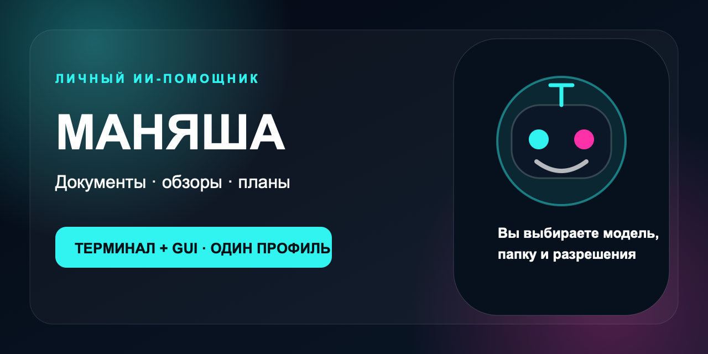

# Маняша



Личный ИИ‑помощник для документов, обзоров и повседневных задач. Терминал и GUI используют один локальный Hermes-профиль; источник модели, рабочую папку и важные разрешения выбирает пользователь.

## Быстрый старт

### macOS

1. Получите `Manyasha-0.2.0-macos.zip` и соседний файл контрольной суммы.
2. Проверьте SHA-256 и распакуйте архив.
3. Запустите `scripts/install-macos.sh`.
4. Следуйте [проверенной инструкции](docs/INSTALL_MACOS.md).

### Windows 11

1. Получите `Manyasha-0.2.0-windows.zip` и соседний файл контрольной суммы.
2. Проверьте SHA-256 и распакуйте архив.
3. В PowerShell запустите `powershell -ExecutionPolicy Bypass -File .\scripts\install-windows.ps1`.
4. Откройте новый PowerShell и выполните `manyasha gui`.

Пакеты macOS и Windows используют один формат локального профиля, разговоров и разрешений. Текущий macOS-пакет не подписан Apple Developer ID; Windows-пакет не подписан Authenticode. Подробности Windows-установки — в [отдельной инструкции](docs/INSTALL_WINDOWS.md).

## Три первых действия

- Сравнить документы и сохранить фактические различия.
- Собрать обзор с проверяемыми источниками.
- Превратить заметки в план без самовольных отправок и изменений календаря.

## Техническая основа

Это отдельный продуктовый срез на Hermes Agent `0.21.2`, commit `5eb99eb2844b22ebb723711b8e6a0bbb80bb5f04`. Движок подключён как Git-submodule в `vendor/hermes-agent`. Запуск использует отдельные `HERMES_HOME`, `HOME`, рабочую папку и историю; `~/.hermes`, OpenCode, пользовательская память и каналы не изменяются.

Проверяемый срез:

1. терминальный Hermes-запуск;
2. реальный запрос к API.Navy без копирования ключа в профиль;
3. разрешённый toolset `file` и отдельная тестовая рабочая папка;
4. чтение двух изменяемых файлов и создание нового результата;
5. та же сессия в штатном Hermes Dashboard;
6. локальные тесты отказа без разрешения, выхода за папку и символических ссылок.

Запуск собственного разговора и общей истории:

```bash
MANYASHA_NAVY_CONFIG_FILE=/absolute/path/to/provider.json manyasha gui
MANYASHA_NAVY_CONFIG_FILE=/absolute/path/to/provider.json manyasha chat --prompt "Помоги превратить заметки в план"
manyasha sessions
```

Для бесплатной недели сайт выдаёт отдельный токен устройства. Он подключается один раз и хранится только в локальном профиле:

```bash
manyasha managed --server https://tech-pravo.ru --token TOKEN_УСТРОЙСТВА
manyasha gui
```

Общий ключ организаторов в клиент не передаётся. Семь дней начинаются на сервере после первого успешного ответа; отклонённый или оборванный запрос срок не запускает.

Запуск закреплённого Hermes:

```bash
npm run setup:hermes
npm test
npm run demo
npm run gui

MANYASHA_NAVY_ENV_SOURCE=/absolute/path/to/provider.env npm run hermes:run
npm run hermes:dashboard
```

Установленная копия предоставляет те же входы через `bin/manyasha` и `bin/manyasha-hermes`. Команда `manyasha-hermes chat` открывает реальный Hermes TUI, `manyasha-hermes dashboard` — GUI того же Hermes-профиля.

`MANYASHA_NAVY_ENV_SOURCE` читается только адаптером `key_cmd`: значение ключа не сохраняется в `config.yaml`, аргументах запуска или репозитории. Профиль требует ожидаемый origin `https://api.navy`.

## Проверенный результат

- Собственный GUI выполнил новую разговорную задачу через `gpt-5.6-terra`; результат сохранился после перезапуска и появился в `manyasha sessions`.
- `demo/hermes-workspace/hermes-result.md` создан живой сессией `20260914_155148_9c42d9`.
- После изменения входных файлов и задания `demo/hermes-workspace/hermes-result-v2.md` создан сессией `20260914_155402_8bc146`.
- Оба результата появились в том же Hermes Dashboard на `http://127.0.0.1:8788`.

## Граница безопасности

Собственный минимальный файловый прототип отклоняет лексический выход и символические ссылки, открывает конечный файл с `O_NOFOLLOW` и проверяется тремя тестами. Это снижает риск случайного выхода, но не устраняет гонку замены промежуточного каталога на всех ОС.

Закреплённый Hermes запускается только с toolset `file` и `HERMES_WRITE_SAFE_ROOT` на тестовую папку. Этот параметр ограничивает `write_file`/`patch`, но не является полной песочницей чтения. Экспериментальный macOS `sandbox-exec`-профиль оставлен opt-in (`MANYASHA_HERMES_USE_SANDBOX=1`), потому что текущий upstream runtime завершается под ним до запуска. До появления подтверждённой OS-песочницы не подключайте личные папки и не включайте terminal/code_execution.

Проверка локальной модели, мессенджеров и полной OS-песочницы ещё не выполнена. Для каждого Windows-выпуска статус чистой установки фиксируется отдельно и не выводится из прохождения тестов macOS.

## Статус поставки

- macOS-архив, контрольная сумма, повторная установка, CLI, локальный GUI, Hermes Dashboard и реальный API.Navy tool-run проверены 15 сентября 2026 года на изолированном профиле.
- Универсальная недельная модель доступа реализуется сервером конференционного продукта и начинается только после первого успешного ответа предоставляемой модели.
- Официальный репозиторий: [StarDust1508/manyasha-agent](https://github.com/StarDust1508/manyasha-agent). Пакеты публикуются отдельно как проверяемые Releases, а не подменяются автоматическим архивом исходников.
- Лицензия Hermes — MIT; уведомление сохранено в [THIRD_PARTY_NOTICES.md](THIRD_PARTY_NOTICES.md). Лицензия собственной оболочки требует решения владельца до публичного открытия.
- Безопасный канал сообщения об уязвимости описан честно в [SECURITY.md](SECURITY.md): конкретный внешний адрес пока не утверждён.
